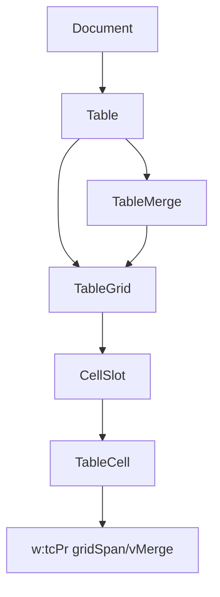

# 表格合并单元格扩展实施 Plan

## 背景

当前表格 API 仅支持物理 `w:tc` 访问。[`Table#columns`](lib/docx/containers/table.rb) 用 `w:tr//w:tc[n]` 取列，合并单元格文档会错位；无 `gridSpan` / `vMerge` 封装，无法安全 merge/unmerge。

详细设计已写入 [`docs/plans/table-merge-cells.md`](docs/plans/table-merge-cells.md)，本 plan 为可执行摘要。

## 架构

**新增模块**
- [`lib/docx/containers/table_grid.rb`](lib/docx/containers/table_grid.rb) — 逻辑网格解析、`cell_at`、缓存
- [`lib/docx/containers/table_merge.rb`](lib/docx/containers/table_merge.rb) — merge/unmerge XML 写操作

**修改模块**
- [`lib/docx/containers/table.rb`](lib/docx/containers/table.rb) — 委托 grid，新增公共 API
- [`lib/docx/containers/table_cell.rb`](lib/docx/containers/table_cell.rb) — 合并读属性 + `unmerge!`
- [`lib/docx/containers/table_column.rb`](lib/docx/containers/table_column.rb) — 基于 grid 构建
- [`lib/docx/containers.rb`](lib/docx/containers.rb) — require 新文件
- [`lib/docx/errors.rb`](lib/docx/errors.rb) — 3 个新异常

## 公共 API

**Table**
- `cell_at(row, col)` — 逻辑坐标
- `each_cell` — 遍历 anchor 格
- `merged?(row, col)`
- `merge_cells(row0, col0, row1, col1)` — 矩形含边界
- `unmerge_cells(row, col)` — 从 anchor 拆分
- `invalidate_grid!` — 结构变更后清缓存

**TableCell**
- `colspan`, `rowspan`, `merged?`, `merge_anchor?`, `merge_continuation?`, `unmerge!`

**异常**（[`lib/docx/errors.rb`](lib/docx/errors.rb)）
- `InvalidMergeRange`, `MergeConflict`, `InvalidMergeTarget`

**行为约定**
- 内容保留在 anchor（左上角），其余格 `blank!`
- 单格 merge → no-op；重叠 → `MergeConflict`
- 保留 `rows[i].cells[j]` 作为物理访问，文档区分两套坐标
- `cell_at` 越界返回 `nil`；合并区域内任意坐标返回 anchor cell
- `columns[col].cells[row]` == `cell_at(row, col)`（anchor，可重复出现），长度 == `row_count`

**关键设计决定（评审后定）**
- `CellSlot` 占位位置存 **anchor 引用**，不用裸 `:occupied`，否则延续/被吞坐标无法反查 anchor
- `columns` 走 grid + 子轴 `w:tr/w:tc`，同时修正合并错位与嵌套表误抓（CHANGELOG 列两类 bugfix）
- 异常放进现有 `Docx::Errors` 模块
- `ensure_tc_pr!` 须将 `w:tcPr` prepend 到 `w:tc` 首位
- grid 宽度以行内 `gridSpan` 累加为准，与 `tblGrid` 不一致时取较大值并 warn
- Fixtures 由生成脚本产出（不手工 Word 制作），保证 CI 可复现

## OOXML 要点

| 操作 | XML |
|------|-----|
| 横向 N 列 | `w:tcPr/w:gridSpan @w:val=N`，删除被吞 `w:tc` |
| 纵向起点 | `w:vMerge @w:val=restart` |
| 纵向延续 | `w:vMerge`（无 val） |
| 拆分 | 清除属性，补空 `<w:tc><w:tcPr/><w:p/></w:tc>` |

写入前需 `ensure_tc_pr!`（现有 [`Container#properties`](lib/docx/containers/container.rb) 仅 `at_xpath`，可能 nil）；新建的 `w:tcPr` 须 prepend 到 `w:tc` 首位。`gridSpan` / `vMerge` 均不改 `tblGrid`，故 `row_count` / `column_count` 不变。

## 实施阶段

### Phase 0 — 前置确认

- 验证现有 `Document#save` 支持 round-trip（最小 save→reopen）
- 新建 fixture 生成脚本（写 `document.xml` + 打 zip），fixture 全部脚本产出

### Phase 1 — 逻辑网格（P0）

- 实现 `TableGrid` + `CellSlot` struct，`build_slots` 解析 `gridSpan` / `vMerge`（占位存 anchor 引用）
- `Table#cell_at`（越界 nil）, `#each_cell`, `#invalidate_grid!`
- **修正** `Table#columns` 走 grid + 子轴 `w:tr/w:tc`（CHANGELOG 标注 bugfix）
- Fixtures（脚本生成）：
  - `spec/fixtures/tables/horizontal_merge.docx`
  - `spec/fixtures/tables/vertical_merge.docx`
  - `spec/fixtures/tables/rect_merge.docx`
- Spec: `spec/docx/containers/table_grid_spec.rb`（含 `columns[col].cells[row] == cell_at(row,col)`）
- 验收：fixture 逻辑坐标正确；[`spec/docx/document_spec.rb`](spec/docx/document_spec.rb) 现有 tables 测试通过

### Phase 2 — 读取 API（P1）

- `TableCell` 合并读属性；`Table#merged?`
- Spec: `spec/docx/containers/table_merge_read_spec.rb`

### Phase 3 — 横向 merge（P2-a）

- `table_merge.rb`：`ensure_tc_pr!`, `set_grid_span`
- `merge_cells` 单行场景
- Fixture: `spec/fixtures/tables/plain_3x3.docx`
- Spec: `spec/docx/containers/table_merge_write_spec.rb`（横向）

### Phase 4 — 矩形 merge（P2-b）

- `set_vmerge`, `ensure_continuation_cells`, 重叠检测
- 扩展 write spec：2x2、3x1、1x3 round-trip（save → reopen）

### Phase 5 — unmerge（P3，纳入 0.11.0）

- `unmerge_cells` / `TableCell#unmerge!`
- 横向补 `w:tc`、纵向恢复独立格
- Spec: `spec/docx/containers/table_unmerge_spec.rb`
- 验收：拆分后每行网格占位 == `column_count`，anchor 文本保留

### Phase 6 — 文档与版本

- [`README.md`](README.md) 合并单元格章节
- [`CHANGELOG.md`](CHANGELOG.md) + [`lib/docx/version.rb`](lib/docx/version.rb) bump 至 **0.11.0**

## 风险缓解

- merge 前后校验每行网格占用与 `tblGrid` 列数一致
- 所有 `w:tc` 插入/删除仅通过 `TableGrid` 定位，避免手写索引
- 延续格写操作在 README 中说明限制

## 不在本期

表格样式、创建表格、嵌套表格、HTML 导出、与 `feature/api-table-image-replace` 集成
